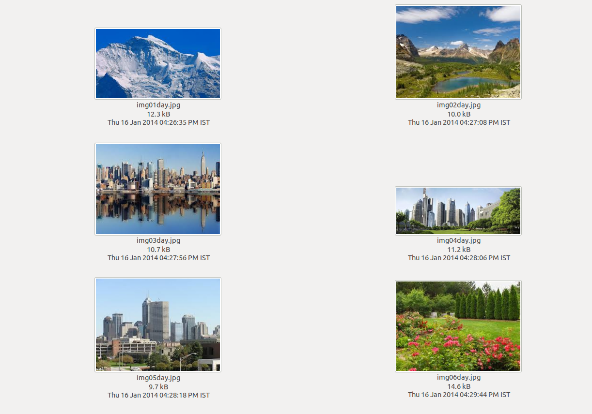
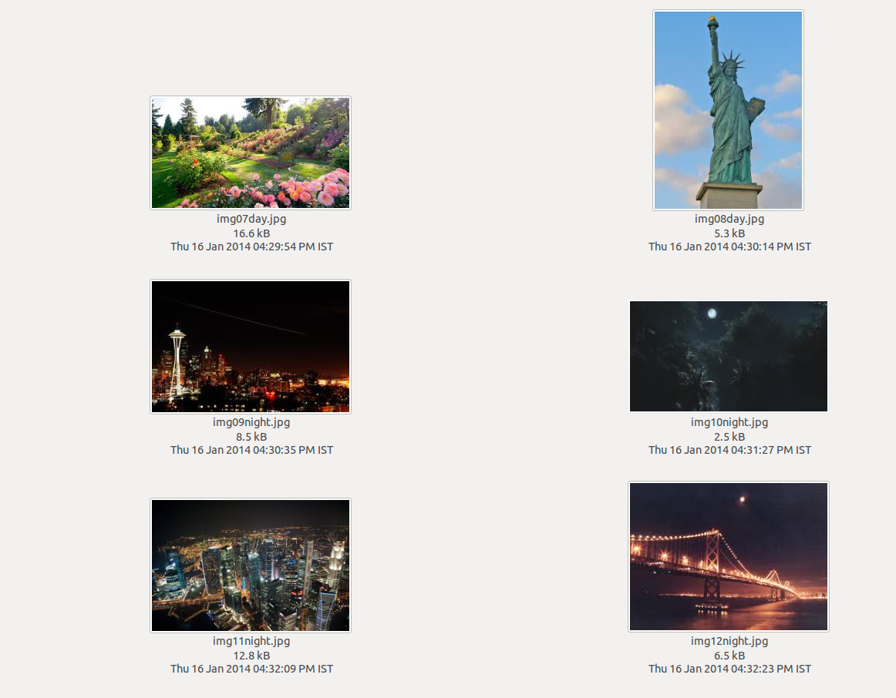

# 🌅 Day or Night Image Classification

This project implements an algorithm to classify whether an image was taken during the **day** or **night**, using only raw pixel values (RGB) as input.

The task is inspired by a HackerRank challenge, where no original image files are provided — only their **flattened pixel data**.

---

## 🧩 Problem Statement

You are given a **2D grid of pixels**, each pixel represented by **three comma-separated integers**: `Blue,Green,Red`. These values range from 0 to 255.

Your goal is to predict if the image corresponds to **day** or **night**, based on perceived brightness.

---

### 📥 Input Format

- Text-based input from `stdin`.
- Each line represents a row of pixels.
- Pixels are space-separated.
- Each pixel is in `Blue,Green,Red` format.

Example:

```
0,0,200 0,0,10 10,0,0
90,90,50 90,90,10 255,255,255
100,100,88 80,80,80 15,75,255
```

---

### 📤 Output Format

A single word:

- `day`
- `night`

(no quotation marks)

---

## 🧠 Logic

The algorithm calculates the **perceived luminance** of each pixel using the [ITU-R BT.601](https://en.wikipedia.org/wiki/Rec._601) standard:

```python
luminance = 0.299 * R + 0.587 * G + 0.114 * B
```

Then, the **average luminance** of the image is computed. If it's above a certain threshold (e.g., 100), the image is considered `day`, otherwise `night`.

This formula reflects how the human eye perceives brightness, being more sensitive to green, followed by red, and least sensitive to blue.

---

## 📷 Sample Image References

These are the actual image thumbnails from which the pixel data was extracted to build the test cases in this challenge (originally from the HackerRank platform).

They include a variety of scenes from both **daytime and nighttime environments**.

### 🖼️ Image Thumbnails





---

## ✅ Result

The final Python implementation successfully passed **all 16 test cases** on the HackerRank platform using the luminance-based strategy with calibrated thresholding.

Check the implementation in [`CameraDetect.py`](CameraDetect.py).
