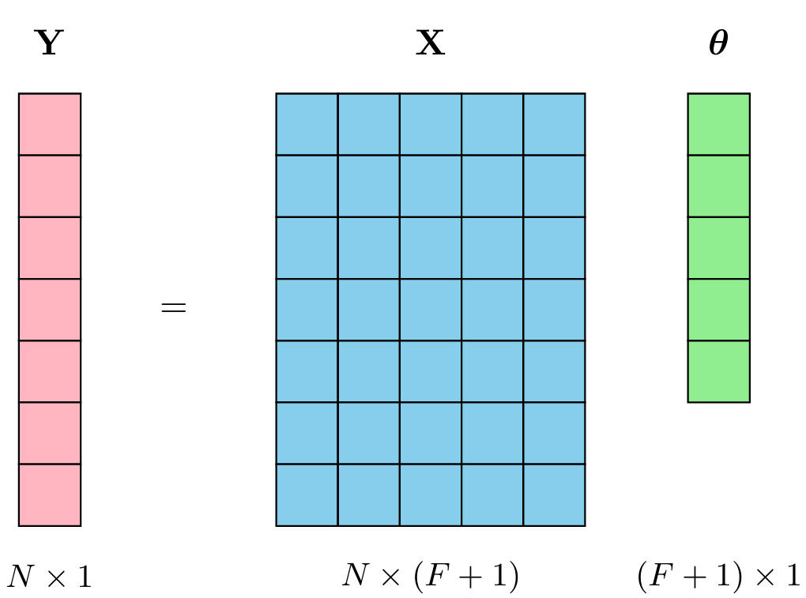

# 📊 Multiple Linear Regression (MLR) - Normal Equation Implementation

This project implements a **Multiple Linear Regression** algorithm using the **Normal Equation** method to find optimal model coefficients.

The implementation uses only **NumPy** and solves the linear system through **LU decomposition**, providing a direct analytical solution without the need for iterative methods.

---

## 🧩 Problem Statement

Given a dataset with **F features** and **N observations**, the goal is to train a multiple linear regression model and make predictions on new test data (e.g., predicting house prices per square meter based on features like location, age, and amenities)

The model follows the form:

$$\huge Y = \beta_0 + \beta_1X_1 + \beta_2X_2 + \ldots + \beta_FX_F + \epsilon$$

Where:
- $Y$: dependent variable (target)
- $X_i$: independent features
- $\beta_i$: model coefficients (including intercept $\beta_0$)
- $\epsilon$: error term
---

## 📥 Input Format

The program reads data via `stdin` in the following format:
```
F N                    # Number of features and observations

x11 x12 ... x1F y1     # Training data (features + target)

x21 x22 ... x2F y2
...

xN1 xN2 ... xNF yN

T                      # Number of test samples

t11 t12 ... t1F        # Test data (features only)

t21 t22 ... t2F
...
```

**Example:**
```
2 3 

1.0 2.0 5.0 

2.0 3.0 8.0 

3.0 4.0 11.0

2 

1.5 2.5 

2.5 3.5
```

---

## 📤 Output Format

For each test sample, the program outputs the predicted value rounded to **2 decimal places**:
```
6.50 

9.50
```
---

## 📐 Normal Equation Method

The Normal Equation provides an analytical solution to find the optimal coefficients by minimizing the **Mean Squared Error (MSE)**:

$$\huge\boldsymbol{\theta} = (\mathbf{X}^T\mathbf{X})^{-1}\mathbf{X}^T\mathbf{Y}$$

Where:
- $\boldsymbol{\theta}$: coefficient vector $[\beta_0, \beta_1, \ldots, \beta_F]^T$
- $\mathbf{X}$: design matrix with bias column (ones) added
- $\mathbf{Y}$: target vector

### 🔢 Matrix Operations Visualization

<div align="center">

</div>


This represents the fundamental equation: $\mathbf{Y} = \mathbf{X}\boldsymbol{\theta}$

Where:
- $\mathbf{Y}$ (pink): Target vector of size $N \times 1$
- $\mathbf{X}$ (blue): Design matrix of size $N \times (F+1)$ (includes bias column)
- $\boldsymbol{\theta}$ (green): Coefficient vector of size $(F+1) \times 1$

The Normal Equation solves for $\boldsymbol{\theta}$: $\boldsymbol{\theta} = (\mathbf{X}^T\mathbf{X})^{-1}\mathbf{X}^T\mathbf{Y}$

---

## ⚡ Advantages of the Normal Equation

### ✅ **Analytical Solution**
- Provides exact solution in one step
- No hyperparameter tuning required (learning rate, iterations)
- Guaranteed to find global minimum

### ✅ **No Iterations**
- Direct computation without convergence concerns
- Deterministic results every time

### ✅ **Mathematical Elegance**
- Based on solid linear algebra principles
- Derived from calculus optimization (setting gradient to zero)

### ⚠️ **Computational Considerations**
- **Time Complexity**: $O(F^3)$ due to matrix inversion
- **Space Complexity**: $O(F^2)$ for storing $\mathbf{X}^T\mathbf{X}$
- Becomes computationally expensive when $F > 10,000$ features

---

## 💻 Implementation Details

The script [`MLR.py`](MLR.py) implements the following steps:

1. **Data Parsing**: Reads training and test data from stdin
2. **Matrix Construction**: Builds design matrix $\mathbf{X}$ with bias column
3. **Normal Equation**: Solves $(\mathbf{X}^T\mathbf{X})\boldsymbol{\theta} = \mathbf{X}^T\mathbf{Y}$ using `np.linalg.solve()`
4. **Prediction**: Computes predictions for test samples
5. **Output**: Formats results to 2 decimal places

### 🔧 **Key Features:**
- Uses **LU decomposition** via `np.linalg.solve()` for numerical stability
- Avoids explicit matrix inversion to prevent numerical issues
- Handles bias term automatically by adding ones column

---

## 📊 Mathematical Derivation

The Normal Equation is derived by minimizing the cost function:

$$\huge J(\boldsymbol{\theta}) = \frac{1}{2m}\|\mathbf{X}\boldsymbol{\theta} - \mathbf{Y}\|^2$$

Taking the gradient and setting it to zero:

$$\huge\frac{\partial J}{\partial \boldsymbol{\theta}} = \mathbf{X}^T(\mathbf{X}\boldsymbol{\theta} - \mathbf{Y}) = 0$$

Solving for $\boldsymbol{\theta}$:

$$\huge\mathbf{X}^T\mathbf{X}\boldsymbol{\theta} = \mathbf{X}^T\mathbf{Y}$$

$$\huge\boldsymbol{\theta} = (\mathbf{X}^T\mathbf{X})^{-1}\mathbf{X}^T\mathbf{Y}$$

---

## ⚖️ When to Use Normal Equation vs Gradient Descent
<div align="center">
<table class="data-table">
  <thead>
    <tr>
      <th scope="col">Aspect</th>
      <th scope="col">Normal Equation</th>
      <th scope="col">Gradient Descent</th>
    </tr>
  </thead>
  <tbody>
    <tr>
      <td><strong>Features</strong></td>
      <td>$F \leq 10,000$</td>
      <td>Any number</td>
    </tr>
    <tr>
      <td><strong>Speed</strong></td>
      <td>Fast for small $F$</td>
      <td>Scales better</td>
    </tr>
    <tr>
      <td><strong>Convergence</strong></td>
      <td>Always converges</td>
      <td>May not converge</td>
    </tr>
    <tr>
      <td><strong>Hyperparameters</strong></td>
      <td>None</td>
      <td>Learning rate, iterations</td>
    </tr>
    <tr>
      <td><strong>Invertibility</strong></td>
      <td>Requires $\mathbf{X}^T\mathbf{X}$ invertible</td>
      <td>No such requirement</td>
    </tr>
  </tbody>
</table>
</div>

---

## 🚀 Usage
```
python MLR.py < input.txt
```
Or provide input directly:

```
echo "2 3
1.0 2.0 5.0
2.0 3.0 8.0  
3.0 4.0 11.0
2
1.5 2.5
2.5 3.5" | python MLR.py
```
✅ Result
The final Python implementation successfully passed all test cases on the HackerRank platform using the Normal Equation method with LU decomposition for numerical stability.

Check the complete implementation in MLR.py.

📂 File Structure

```
├── MLR.py              # Multiple Linear Regression implementation (Normal Equation)
├── MLR.png             # Matrix operations visualization diagram
└── README.md           # Project documentation and mathematical explanation
```

🧠 Notes

This project is ideal for students and data scientists seeking to understand the mathematical foundation of linear regression without relying on high-level machine learning libraries.
The Normal Equation approach provides deep insights into the analytical solution of linear regression problems and serves as an excellent educational tool for understanding the underlying mathematics.
